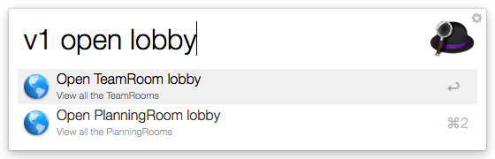
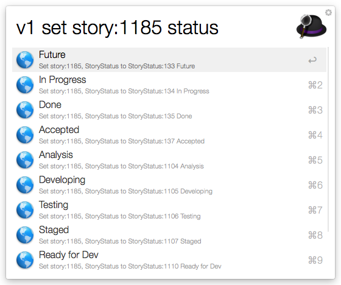

# VersionOne.alfred.workflow

[Alfred 2](https://www.alfredapp.com/) Workflow for interacting with a [VersionOne](https://www.versionone.com/) instance. To learn more about the VersionOne API visit [the documentation site](https://community.versionone.com/Developers)

## Workflows

Enter your VersionOne instance's url  
> Triggers: `v1url`  

Enter your VersionOne API token: 
//Example: Bearer XXXXXXXXXXX  
> Triggers: `v1token`

Open lobby:
> Triggers: `v1 open lobby`

 Open team room by name:
> Triggers: `v1 open teamroom <team room name>`

 Lookup VersionOne assets by type and open asset
> Triggers: `v1 open epics` | `v1 open storys`

 Open VersionOne asset by oid
> Triggers: `v1 open story:12345`

 Open VersionOne asset by name
> Triggers: `v1 open <asset-type> <asset-name>`

 Set single value relations to assets
 > Triggers: `v1 set <oid> <relation-name>`

 